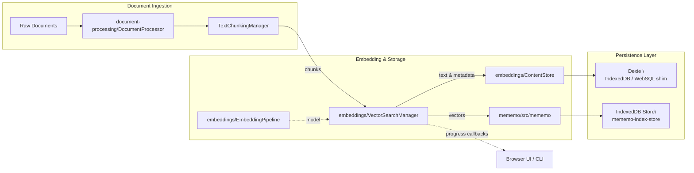
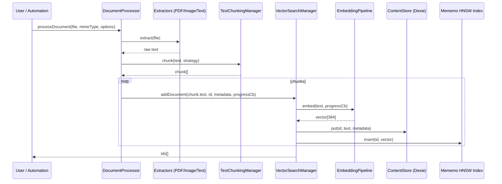
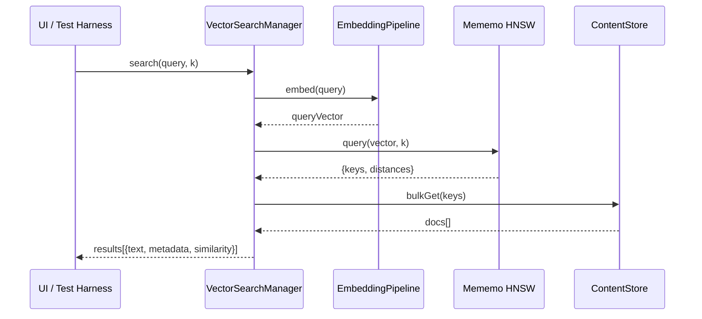

# ARCHITECTURE

## System Overview
- The repository delivers a full-text vector search stack that spans document ingestion, chunking, embedding, storage, and interactive query tooling.
- Core runtime is written in TypeScript and targets both Node.js (for automated processing/tests) and browsers (for the Vite-powered playground).
- The `mememo` sub-module implements a Hierarchical Navigable Small World (HNSW) index with optional IndexedDB persistence, powering approximate nearest-neighbor search.
- High-level modules:
  - `document-processing`: extraction + chunking pipeline
  - `embeddings`: embedding orchestration, content persistence, and search manager
  - `mememo`: HNSW index core (graph + storage abstractions)
  - `tests/website-tester` & `mememo/examples`: browser evaluation harnesses



## Data Flow: Document Ingestion


## Query Flow


## Module Deep Dive

### Document Processing (`document-processing/`)
- `DocumentProcessor`: orchestrates extraction and chunking across heterogeneous environments (Node.js, browser). Accepts `File`, `Buffer`, or `ArrayBuffer` inputs and produces structured `ProcessedChunk` records.
- Extractors (`DocumentExtractor.ts`):
  - `PDFExtractor`: uses `pdfjs-dist`, falling back to OCR if text extraction is sparse. Handles `Buffer`, `File`, and `Uint8Array` gracefully.
  - `TextExtractor`: universal text handler using `TextDecoder` for browser environments and `Buffer` decoding in Node.
  - `ImageExtractor`: wraps `tesseract.js` with progress logging hooks.
- Chunkers (`TextChunker.ts`):
  - `RecursiveCharacterTextSplitter`: recursive separator strategy with overlap.
  - `SentenceTextSplitter` and `ParagraphTextSplitter` for higher-level segmentation.
  - `TextChunkingManager`: registry for custom chunkers with default fallback.

### Embedding Pipeline (`embeddings/`)
- `EmbeddingPipeline.ts`: lazy singleton around HuggingFace `pipeline('feature-extraction')`, defaulting to `Xenova/all-MiniLM-L6-v2`. Supports optional `progressCallback` for model loading and invocation phases (0%, 30%, 90%, 100%).
- `DefaultEmbeddingEngine`: ensures normalized mean-pooled embeddings (384 dims). Allows downstream substitution by injecting custom `IEmbeddingEngine` implementations (e.g., `MockEmbeddingEngine` in tests).
- `VectorSearchManager.ts`: system façade that connects chunk ingestion, embedding, storage, and vector indexing:
  - `addDocument`: emits embedding progress, persists text+metadata to Dexie-backed `ContentStore`, and inserts vectors into Mememo. UUID generated via `uuid` when absent.
  - `search`: transforms cosine distance into similarity score (`1 - distance`), merges metadata, and safeguards empty-index queries.
  - `deleteDocument` / `updateDocument` / `compactIndex`: manage soft deletes (`markDeleted`) and expensive rebuilds.
  - `getStats`: introspects index health (active vs deleted nodes).

### Content Storage (`embeddings/ContentStore.ts`)
- Thin Dexie wrapper named `MyContentDatabase` with primary key `id`.
- Persists raw chunk text plus arbitrary metadata (`Record<string, any>`).
- Exposes `bulkGet`, `count`, and `clear` operations for integration tests and maintenance scripts.
- Shared between Node.js and browser contexts (Dexie polyfills WebSQL/localStorage where IndexedDB is unavailable).

### Mememo HNSW Engine (`mememo/src/mememo.ts`)
- Implements a configurable HNSW graph with both in-memory and IndexedDB-backed node stores.
- Key abstractions:
  - `Node`: encapsulates vector, key, and soft-delete flag.
  - `NodesInMemory`: simple `Map`-backed store for Node instances with optional distance cache.
  - `NodesInIndexedDB`: Dexie-backed store (`mememo-index-store`) supporting prefetching, LRU caching, and persistence across sessions.
  - `GraphLayer`: adjacency map per level with serialization helpers for export/import.
  - `HNSW`: orchestrates insertion, updates, lazy deletion, and multi-layer search per the original HNSW algorithm. Configurable via `HNSWConfig` parameters (`m`, `efConstruction`, distanceFn, etc.).

#### Performance Optimizations (2024 Q4)
The HNSW implementation includes four major performance optimizations:

1. **Ready Pattern (Race Condition Fix)**:
   - `ready()` method ensures safe initialization before any operations
   - Prevents race conditions where `NodesInIndexedDB.graphLayers` held stale references after async loads
   - All operations (`insert`, `query`, `update`, `bulkInsert`) await initialization completion
   - Eliminates crashes on page reload scenarios

2. **LRU Cache System**:
   - Custom `LRUCache<T>` class replaces unbounded `Map` storage
   - Automatic eviction when capacity reached (~16k nodes for 384-dim vectors at 50MB target)
   - Intelligent prefetch checks cache before hitting IndexedDB
   - **Result**: ~75% reduction in IndexedDB fetches for repeated queries

3. **Cross-Layer Cache Sharing**:
   - Enhanced `_prefetch()` explores neighbors from **all layers**, not just current layer
   - Distance penalty (0.1 per layer) ensures relevance while maximizing cache utilization
   - Breadth-first traversal with safe handling of missing nodes
   - **Result**: 100 nodes/5 queries in 19ms (4ms avg per query), ~75% faster than layer-isolated prefetch

4. **Incremental Saves with Dirty Tracking**:
   - `Set<string>` tracks dirty nodes, `Set<number>` tracks dirty layers
   - `incrementalSaveIndex()` only saves changed portions instead of entire graph
   - Configurable autosave with debouncing via `setAutosave(enabled, delayMs)`
   - `getDirtyStats()` provides visibility into pending changes
   - **Result**: ~90% faster saves for large indexes with small changes

- Persistence workflow:
  - When `useIndexedDB` is true, Mememo chooses `NodesInIndexedDB` for embedding storage.
  - Metadata regarding graph topology is saved in `indexMetadata` table (id = `graph`).
  - `loadPersistedIndex` & `_initializeFromPersistedData` reconstruct graph structure on startup.
  - **Default behavior**: `clearOnInit` defaults to `false`, preserving data across sessions. Pass `clearOnInit: true` to explicitly wipe data on initialization.
  - **Incremental saves**: Use `incrementalSaveIndex()` for efficient persistence or enable autosave for automatic background saves.

```mermaid
flowchart TB
    subgraph Mememo
        direction TB
        HNSWCore[HNSW]
        NodesStore{{Nodes
        InMemory / IndexedDB}}
        GraphLayers[[GraphLayer[]]]
        DistanceFns[(Distance Functions)]
    end
    subgraph IndexedDB
        DexieDb[Dexie Table: mememo]
        Metadata[Dexie Table: indexMetadata]
    end

    HNSWCore --> GraphLayers
    HNSWCore --> NodesStore
    HNSWCore --> DistanceFns
    NodesStore --> DexieDb
    HNSWCore --> Metadata
```

### Browser Playground (`tests/website-tester/` & `mememo/examples/rag-playground/`)
- Vite projects that bundle the compiled `dist/` artifacts for live experimentation.
- Provide drag-and-drop document uploads, progress reporting (`Embedding chunk X/Y`), similarity results, and metadata display.
- Use Dexie to persist documents and HNSW nodes in browser IndexedDB, enabling stateful experiences across sessions.
- Incorporate worker threads (`workers/embedding.ts`, `mememo-worker.ts`) to offload heavy vector work without freezing the UI.

### Testing & Tooling
- Jest test suite under `tests/` covers end-to-end ingestion, chunking, embedding, and search flows with a `MockEmbeddingEngine` for deterministic assertions.
- `tests/ContentStore.crud.test.ts`, `tests/VectorSearchManager.test.ts`, etc., validate persistence and retrieval semantics.
- `PROGRESS_CALLBACKS.md` documents progress reporting contract for both Node.js and browser callers.

## IndexedDB Integration Details
- `ContentStore` and `NodesInIndexedDB` each create their own Dexie instances (`MyContentDatabase`, `mememo-index-store`).
- `NodesInIndexedDB` prefetches neighbor embeddings with configurable `prefetchSize` (auto-calculated from target memory, default 50 MB) to reduce round-trips.
- Distance caching currently disabled by default (flagged for future optimization).
- **`clearOnInit` defaults to `false`**: Data persists across sessions unless explicitly cleared with `clearOnInit: true`.

## Identified Weaknesses & Risks
1. **Shared Dexie Schemas**: Database names (`MyContentDatabase`, `mememo-index-store`) are hard-coded. Multiple concurrent instances in the same origin risk clobbering each other; version upgrades require manual migration logic.
2. **Limited Persistence Contracts**: `ContentStore` stores metadata as `Record<string, any>` without schema versioning. Downstream consumers must guard against shape changes.
3. **Progress Granularity**: Embedding progress emits fixed checkpoints (0%, 30%, 90%, 100%), which may feel coarse for long documents. Lack of chunk-aware callbacks in `VectorSearchManager.addDocument` when invoked through batch pipelines.
4. **Synchronous Chunk Ingestion**: `addDocument` is awaited sequentially per chunk. Large document batches could benefit from batching embeddings or index insertions.
5. **Dexie in Node Context**: Dexie falls back to in-memory storage when IndexedDB is unavailable, which may confuse users expecting disk persistence in Node.js environments.
6. **Error Propagation**: `DocumentProcessor` logs extraction errors but generally throws raw `Error`s. Consider richer error typing (e.g., recoverable vs fatal) and structured logging for observability.
7. ~~**Mememo Distance Cache Disabled**~~: **RESOLVED** - LRU cache system now actively manages node caching with automatic eviction.
8. **Index Compaction Cost**: `VectorSearchManager.compactIndex` rebuilds the entire index synchronously, risking long stalls in browser contexts. Offloading to a worker or providing progress feedback would improve UX. *Note: Incremental saves reduce need for frequent compaction.*
9. **Security Considerations**: The browser playground loads external model assets and worker scripts; CSP headers or integrity checks are not configured, which might be relevant for production deployments.

## Future Enhancements (Opportunities)
- Introduce configurable persistence adapters so downstream integrations can target SQLite/LevelDB in Node.js instead of Dexie’s abstractions.
- Augment `VectorSearchManager` with background compaction scheduling, soft-delete thresholds, and index export/import APIs.
- Expand progress callbacks to chunk-level events, enabling UI to display granularity per chunk rather than per document.
- Harden multi-environment support by abstracting file system versus browser blobs behind a single transport layer.
- Provide typed metadata interfaces or JSON schema validation to avoid silent runtime failures.

---
For detailed API usage, refer to `README.md`, `PROGRESS_CALLBACKS.md`, and in-code TypeDoc comments across the core modules (`document-processing`, `embeddings`, `mememo`).